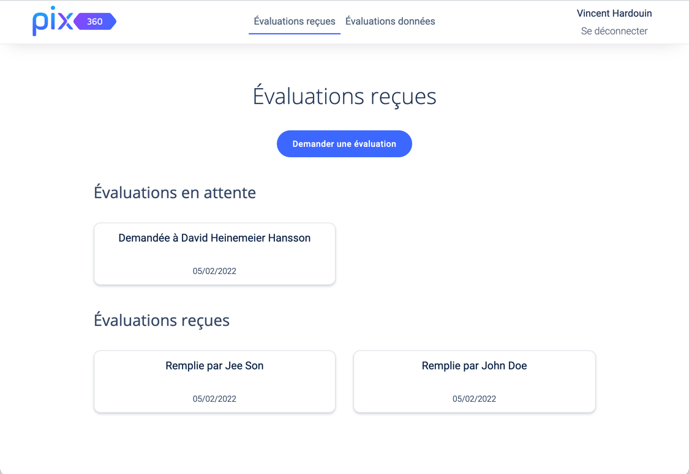

# PIX 360

Cette application permet de faciliter la gestion des évaluations 360. 

Parmi les fonctionnalités majeures : 
- SSO via Google, qui permet de restreindre l'accès aux membres d'une organisation
- Envoi d'une demande d'évaluation par e-mail 
- Notification de reception d'une nouvelle évaluation
- Stockage des évaluations reçues et données
- Évaluations chiffrées de bout-en-bout



# Requirement

- App Google :
You need to create a google ID client OAuth 2.0 for the connection with the SSO.
To have them, follow the steps on this link : 
https://developers.google.com/identity/protocols/oauth2

# One-Click Deployment

[](https://my.scalingo.com/deploy?source=https://github.com/VincentHardouin/pix-360#main) 

# Installation

1. Copy sample.env

```shell
cp sample.env .env
```

2. Run docker-compose :
```shell
docker-compose up -d
```

3. Run pix 360 app :
```shell
docker compose run --rm --service-ports --name pix360 app
```

Inside Pix 360 container: 
4. Install gems and packages :
````shell
bundle install && yarn install
````

5. Prepare database :
````shell
rails db:reset && rails db:migrate
````

6. Run server : 
````shell
rails server -p $PORT -b 0.0.0.0
````

# Docker usage : 

- To run one container :

```shell
docker compose run --rm --service-ports --name pix360 app
```

- To run in multiple terminal windows:
```shell
docker exec -it pix360 /bin/bash
```

# Development 

- Run lint :

```shell
bundle exec rubocop -a
```
