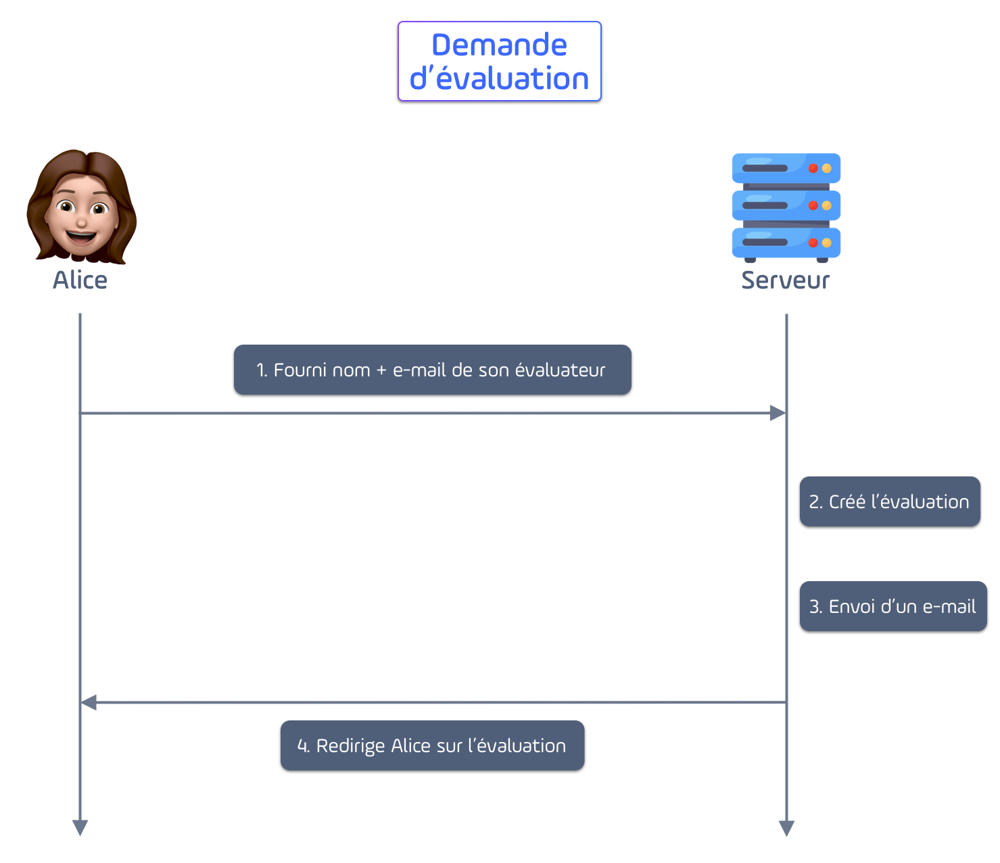
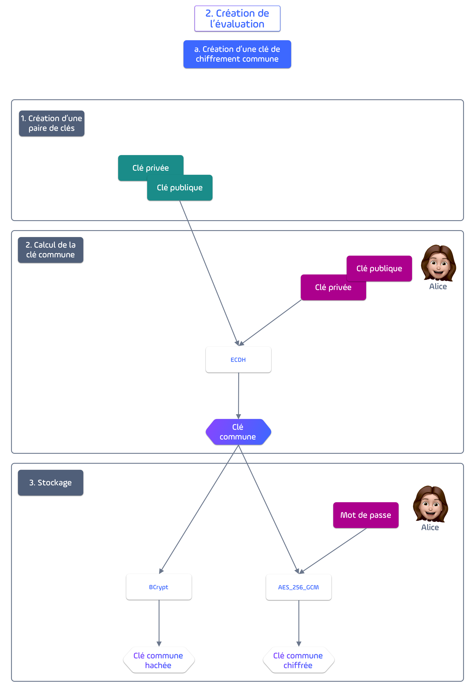
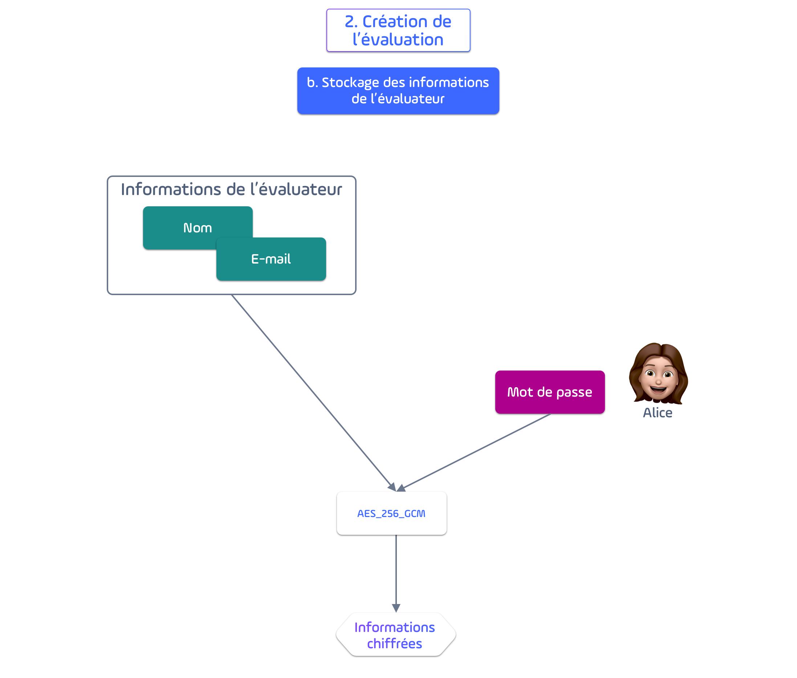
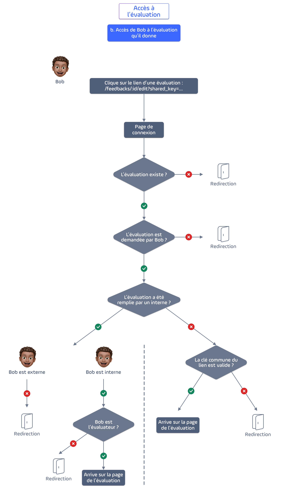
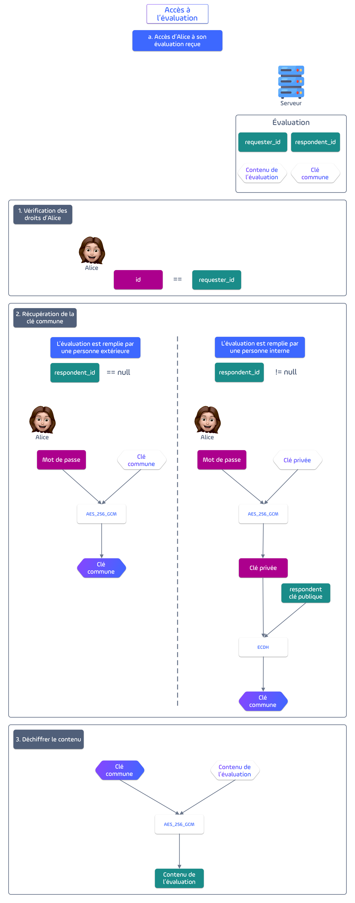

# Sécurité - Fonctionnement du chiffrement de bout en bout

L’application permet de recueillir des évaluations. Ces évaluations contiennent des informations personnelles et nous prenons à cœur la sécurité des données.

Pour éviter tout problème de confidentialité ou de fuites de données, nous voulons qu’une personne souhaitant une évaluation puisse la demander et la recevoir sans que personne n’en connaisse le contenu sauf les 2 acteurs : le demandeur et le receveur.

Afin de limiter l’accès à ces 2 acteurs, nous avons mis en place un chiffrement de bout en bout.

Le chiffrement de bout en bout est donc fait entre :

- l’évalué qui a un compte sur la plateforme
- et l’évaluateur qui peut avoir un compte ou non.

## Création de l'évaluation

Prenons l'exemple d'Alice qui fait une demande d'évaluation à Bob. 

Nous pouvons distinguer ces 4 étapes durant sa demande d'évaluation : 

Le début du chiffrement se fait au moment de la création de l'évaluation, à l'étape 2. 
Durant cette étape, grâce à l'algorithme d'Eliptic Curve de Diffie Hillmann, 
nous convenons d'une clé commune qui sera utilisée pour le chiffrement du contenu de l'évaluation.

Durant la création de l'évaluation,s'effectue aussi le chiffrement des données de l'évaluateur (Bob)
fourni par Alice pour les enregistrer en base de données. Cela permet de nous assurer que seulement Alice puisse y avoir accès.

## Accès à l'évaluation

### 1. Bob souhaite répondre à la demande d'évaluation qu'Alice lui a envoyée. 

Pour cela, il se rend sur le formulaire d'évaluation grâce à l'e-mail qu'il a reçu ou au lien qu'Alice lui a envoyé. 

Le lien contient la clé commune, elle permet dans le cas où Bob est externe de chiffrer les données.

### 2. Alice souhaite voir l'évaluation qu'elle a reçue de Bob

En cliquant sur l'évaluation, plusieurs vérifications vont être faites. 

Dans un premier temps, nous vérifions qu'Alice est bien la personne qui a créé l'évaluation.
Puis nous calculons ou retrouvons la clé commune de chiffrement. 
Et enfin, nous déchiffrons le contenu. 

